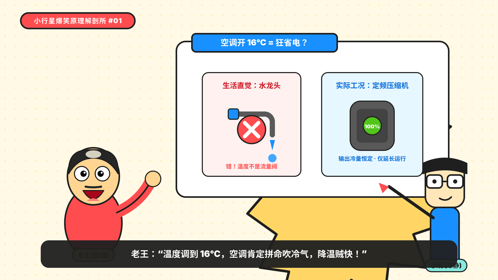
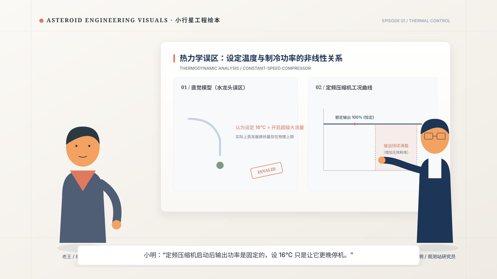
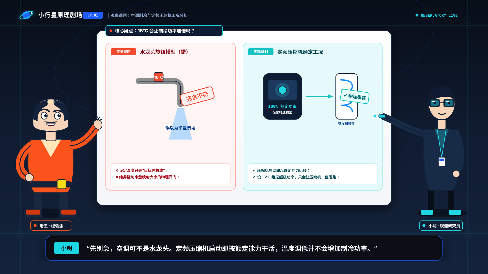

# 原创视觉方向提案与选型论证 (Three Design Directions & Selection)

为“小行星AI观测站”旗下工程科普动画栏目《小行星原理剧场》（Asteroid Principle Theater）建立三个风格鲜明、技术路径可行的原创视觉方向。

---

## 1. 提案方向一：扁平矢量喜剧感 (Flat Vector Cartoon & High-Contrast Satire)

### 1.1 核心定义与关键词
- **关键词**：高对比、粗黑描边（4-6px）、表情包式夸张、极简几何色块、极速笑点。
- **目标受众**：B站青少年/大学生、短视频泛知识轻度爱好者、偏好轻松解压搞笑风格的年轻群体。
- **栏目建议名**：小行星爆笑原理解剖所 (Asteroid Principle Lab: Satire Edition)

### 1.2 人物造型逻辑
- **老王**：圆滚滚的胖身材（4头身），粗黑浓眉，夸张的秃顶反光，大红 T 恤，肢体为无骨骼橡胶管风格（Rubber Hose），情绪激动时眼睛会脱出眼眶或化作火团。
- **小明**：极窄的长方体身材（6头身），巨大圆黑框眼镜，冷静面瘫，蓝白连帽衫，动作极快、出招精准，经常掏出巨大标尺或红叉打脸老王。

### 1.3 背景与技术图解语言
- **背景**：高纯度明亮纯色背景（浅奶黄/薄荷绿），极少物理装饰，所有空间通过 2D 贴纸化道具展现。
- **图解**：大量使用漫画符号（大汗滴、惊叹号爆裂纹、夸张的大叉与对勾、卡通火焰与冰晶）。

### 1.4 色彩、线条、材质与光影
- **色彩**：高饱和波普三原色（亮红 `#FF4D4F`, 柠檬黄 `#FFD666`, 电光蓝 `#1890FF`, 墨黑 `#1F1F1F`）。
- **线条**：均匀 4px-6px 黑色粗描边，圆润倒角。
- **材质与光影**：0 渐变、0 材质、纯硬边扁平色块。

### 1.5 适用性与量产评估
- **优势**：绘制简单，动画帧率要求低（12-15fps 即可出效果），表情极易产生短视频传播效应。
- **劣势与引擎风险**：
  - 科技严肃性不足，当解释复杂的 HVAC 闭环控制或多回路管网时，画面容易沦为“儿童动画”；
  - 缺乏母品牌“小行星AI观测站”的科技质感与数据深度；
  - 长期复用容易产生审美疲劳。

---

## 2. 提案方向二：轻质感现代二维动画感 (Modern Tactile 2D & Precision Storybook)

### 2.1 核心定义与关键词
- **关键词**：柔和微质感、精致无描边/极细描边（1.5px）、温和纸面色、低饱和度莫兰迪科技色、杂志插画风、微噪点粒子。
- **目标受众**：一线城市工程师、科技白领、对审美品质要求苛刻的技术管理者与深度知识探索者。
- **栏目建议名**：小行星工程绘本 (Asteroid Engineering Visuals)

### 2.2 人物造型逻辑
- **老王**：5头身，写实比例暖男大叔，穿复古深棕工装夹克与浅卡其工装裤，胡茬与卷发采用精细几何切角，表情幽默而克制。
- **小明**：5.8头身，修长学术风青年，穿燕麦灰高领毛衣与深蓝马甲，无框细眼镜，手持平板电脑，动作细腻自然。

### 2.3 背景与技术图解语言
- **背景**：采用水洗纸纹理（Paper Texture）与柔和漫反射环境光，室内场景充满木质、金属拉丝和磨砂玻璃材质。
- **图解**：精美如同《经济学人》或《国家地理》的科技插图，管线具有细腻的内部流动高光，设备剖面带有半透明 X-Ray 效果。

### 2.4 色彩、线条、材质与光影
- **色彩**：低饱和典雅色谱（暖米白 `#F9F6F0`, 普鲁士蓝 `#1D3557`, 鼠尾草绿 `#839788`, 焦糖橙 `#E07A5F`）。
- **线条**：1.5px 浅灰/深色精细线条，大量使用无描边色块嵌套。
- **材质与光影**：微渐变（Soft Gradient）、环境光遮蔽（Ambient Occlusion）、轻微胶片噪点。

### 2.5 适用性与量产评估
- **优势**：质感极其高级，品牌信任度与美誉度极高，适合高规格商业合作与课程交付。
- **劣势与引擎风险**：
  - 资产制作成本高，每个图解需精细打光；
  - 程序化自适应排版难度大，在 360p 手机预览或快速转场时，精细细节容易被视频压缩算法破坏；
  - 幽默喜剧节奏与此种严肃优雅画风容易产生割裂。

---

## 3. 提案方向三（推荐）：观测站遥测与角色舞台融合感 (Observatory Telemetry & Character Stage Hybrid)

### 3.1 核心定义与关键词
- **关键词**：**母品牌 DNA 深度承接、暗夜深蓝与暖纸对比、遥测青与信号橙点睛、模块化工程网格、幽默角色与硬核图解和谐共生**。
- **目标受众**：中国理工科学生、工程师、对生活原理与前沿科技充满好奇的广大中文视频受众。
- **正式推荐栏目名**：**《小行星原理剧场》 (Asteroid Principle Theater)**
- **栏目口号**：**把复杂原理画明白 (Clarify Engineering Principles)**

### 3.2 人物造型逻辑
- **老王 (4.8头身，生活经验派 / 工程老炮)**：
  - 健谈微胖体型，圆方脸轮廓，特色发型（侧边规整、头顶微秃但极富个性），两撇干练胡须；
  - 服装：信号橙与暖驼色工装背心，深深灰长裤，腰间挂着实用工程卷尺与笔；
  - 角色动作：大开大合、直觉拍脑门、叉腰质疑、顿悟狂喜；
  - 剪影特征：外轮廓饱满有力，头身比例稳重，一眼即知是经验丰富但容易陷入直觉误区的前辈。
- **小明 (5.5头身，观测站青年科学家 / 遥测分析师)**：
  - 修长挺拔体型，干净的几何短发，佩戴母品牌特制的“星轨智能数据眼镜”（透光青色镜片）；
  - 服装：观测站特制深蓝（#101C31）研究员夹克、遥测青（#1FD6E2）内衬与胸前专属小行星观测编号勋章（OBS-01）；
  - 角色动作：推眼镜、精准遥控图解、调出数据卡片、严谨递进推导；
  - 剪影特征：垂直线条分明，眼镜与夹克领口构成尖锐识别特征。

### 3.3 背景与技术图解语言
- **空间舞台化（Three-Layer Depth）**：
  - 顶部与背景暗部融入母品牌深空深蓝（#101C31），带有微妙的 8px 遥测刻度网格；
  - 中景核心图解区采用明亮清晰的“观测纸面”（#F6F8FA），确保图表在任何设备上清晰可读；
  - 前景为角色互动操作台，为人物表演留出绝对安全区。
- **图解语言**：
  - 统一 2.5px 纯净中粗线条，节点与管线带有流动指示，状态灯（正常/工作/警报）语义清晰；
  - 所有图卡基于 8px 网格规范，自适应撑开，杜绝任何文字溢出与裁切。

### 3.4 色彩、线条、材质与光影
- **主色谱**：
  - 观测深蓝 `Observatory Night` (`#101C31`) —— 宇宙、深度、片头转场与全局底色；
  - 轨道亮蓝 `Orbit Blue` (`#1F5CFF`) —— 结构主线、激活状态、科技高光；
  - 遥测青 `Telemetry Cyan` (`#1FD6E2`) —— 数据流、冷量、有效通道、验证通过；
  - 信号橙 `Signal Orange` (`#F04B2F` / `#FF7D00`) —— 冲突、发热、误区高亮、老王主色；
  - 暖观测纸 `Observation Paper` (`#F6F8FA` / `#FFFFFF`) —— 图解卡片底色，确保 360p 极速辨识；
  - 碳墨黑 `Charcoal Ink` (`#13223A`) —— 文本与轮廓线。
- **线条**：英雄外轮廓 3.5px，标准结构线 2.5px，次级标注线 1.5px。
- **光影与材质**：硬边插画 + 8% 纯净环境微投影，高对比、无冗余渐变，程序渲染极度友好。

### 3.5 推荐理由与系统收益
1. **母品牌资产最大化**：让观众一眼看出这是“小行星AI观测站”旗下的正统子频道，又具备独立的动画表演魅力；
2. **兼顾幽默表演与硬核科普**：老王的暖橙色生活感与小明的冷青色科技感在舞台上形成绝佳戏剧张力，图解区既能放生活水龙头，又能放工业级冷水机组与 PID 控制方框图；
3. **程序化与量产友好度极致**：
   - 纯矢量 SVG 架构，无位图依赖，文件极小（单图通常 < 30KB）；
   - 标准锚点与统一 8px 网格，LayoutEngine 与 SubtitleRenderer 可轻松计算碰撞盒；
   - 16:9 与 9:16 自适应转换只需重排三层容器，无需重绘角色与图解。

---

## 4. 三方向全维度对比矩阵

| 维度 | 方向一：扁平矢量喜剧感 | 方向二：轻质感二维动画感 | 方向三（推荐）：观测站遥测与角色舞台 |
|---|---|---|---|
| **母品牌契合度** | 弱（偏离母品牌科技基因） | 中（偏向设计杂志风） | **强（完美承接小行星观测站 DNA）** |
| **科技图解清晰度** | 中（受粗描边限制） | 极高（精细图解） | **极高（高对比工程网格 + 清晰色标）** |
| **喜剧幽默承载力** | 极强 | 弱（偏克制） | **强（生动角色 + 严谨反差萌）** |
| **360p 手机端可读性**| 极高 | 较低（细线条易模糊） | **极高（大色块 + 高对比 + 粗细分层）** |
| **9:16 竖屏自适应难度**| 低 | 高 | **极低（模块化三层舞台）** |
| **Python 渲染引擎复杂度**| 极低 | 极高（需复杂滤镜与混合）| **低至中（纯净 SVG 图层与基础矩阵变换）** |
| **资产复用与扩展性** | 中 | 低 | **极高（已建立 HVAC/控制/电子标准件库）** |

---

## 5. 结论

**正式选定【方向三：观测站遥测与角色舞台融合感】作为全套视觉系统、角色体系、场景库、图解库和样片重设计的唯一推进方向。**
