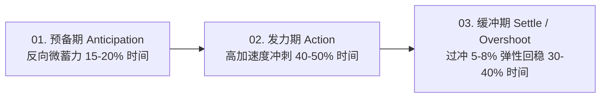
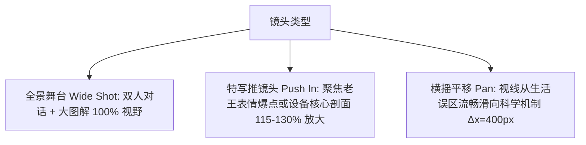

# 小行星原理剧场动效与镜头语言规范 (Motion & Camera System Specification)

版本：1.0.0
栏目名：小行星原理剧场 (Asteroid Principle Theater)
设计口号：把复杂原理画明白 (Clarify Engineering Principles)

---

## 1. 核心动效哲学与物理法则 (Motion Principles)

### 1.1 三段式物理运动曲线 (Anticipation - Action - Settle)
任何角色肢体动作或大组件入场，均必须遵循物理世界的动量与弹性规律，禁止使用线性无缓冲插值（Linear Interpolation）：



- **缓动函数推荐**：
  - 标准入场/发力：`cubic-bezier(0.34, 1.56, 0.64, 1)`（带微过冲回弹）；
  - 平滑过渡：`cubic-bezier(0.16, 1, 0.3, 1)`（Expo Out）；
  - 机械流程指示：`cubic-bezier(0.4, 0, 0.2, 1)`（Standard Ease-In-Out）。

---

## 2. 角色基础动作规范与参数表 (Character Action Spec)

| 动作 ID | 核心动作语义 | 建议总时长 | 推荐关键帧幅度 (Amplitude) | 动效阶段分解 | 适用场景 |
|---|---|---|---|---|---|
| `idle` | 待机呼吸与轻微重心切换 | 2.8s 循环 | 躯干 y ±3px, 手臂旋转 ±1.5° | 上升 1.4s, 下降 1.4s 平滑循环 | 角色未发言时的自然待机 |
| `talk` | 说话手势伴随与身体起伏 | 0.8s - 1.2s 循环 | 手部 y ±8px, 头部旋转 ±2.5° | 随真实音量振幅微变，非固定机械抖动 | 对白表达期间 |
| `point` | 手臂抬起，指向主图解/设备 | 0.45s 单次 | 手臂抬起 45°- 65°, 食指/光标微前伸 | 预备回拉 0.08s → 快速刺出 0.22s → 回弹停顿 0.15s | 引导观众注意图解特定节点 |
| `think` | 托腮/抱胸，头微倾斜，视线向上 | 0.6s 单次入态 | 头部倾斜 8°- 12°, 眼睛向上 15° | 缓动进入，持续微呼吸待机 | 遇到疑点、产生困惑 |
| `nod` | 笃定点头，赞同对方 | 0.5s 单次 (2次起伏)| 头部 y +12px, 旋转 +6° | 快速下沉 0.12s → 回弹 0.13s (重复 2 遍) | 确认原理、达成共识 |
| `shake` | 摇头否定，指出错误 | 0.6s 单次 (3次摆动)| 头部 x ±10px, 旋转 ±5° | 左右摆动衰减：±10px → ±6px → ±2px → 0 | 否定生活误区 |
| `shock` | 身体后仰，眼睛放大，嘴型张大 | 0.35s 快速爆发 | 躯干后仰 12°, y -15px, 汗滴弹出 | 瞬间弹起 0.12s → 高频微震 0.1s → 下沉落定 0.13s | 被打脸、得知意外真相 |
| `celebrate`| 双手高举，欢呼雀跃，顿悟 | 0.8s 循环/单次 | 手臂举过头顶，身体向上跳动 20px | 快速起跳 0.25s → 滞空 0.15s → 落地回弹 0.4s | 豁然开朗、片尾结论 |
| `walk` | 角色横向走入/走出画面 | 0.6s / 步 (循环) | 骨盆上下 ±6px, 步伐跨度 80px | 3 帧步态循环（起步、腾空、着地） | 镜头入场与角色换位 |
| `run` | 慌张/急促奔跑 | 0.35s / 步 (循环)| 躯干前倾 18°, 上下 ±12px, 跨度 140px | 3 帧快速跑步循环，身后带尘土特效 | 紧急情况、急于验证 |
| `angry` | 握拳跺脚，头顶冒气 | 0.5s 循环 | 双肩耸起 8px, 头部高频微抖 ±2px | 蓄力下沉 → 爆发微颤 | 遭遇反常识、情绪爆发 |
| `laugh` | 仰头大笑，手拍大腿 | 0.7s 循环 | 躯干向后 15°, 嘴部快速循环张合 | 3 帧仰天大笑循环 | 喜剧高潮、嘲笑误区 |
| `cry` | 抱头痛哭、流宽粉泪 | 0.8s 循环 | 双手捂脸，泪水向下喷涌 | 躯干抽泣起伏 | 发现多花电费、后悔莫及 |
| `sweat` | 尴尬擦汗，嘴角抽搐 | 0.6s 单次 | 抬单手擦额角，汗滴顺脸颊滑落 | 擦拭动作 0.35s → 尴尬定格 0.25s | 辩解失败、认知被颠覆 |
| `whisper` | 侧身凑近，手挡在嘴边 | 0.5s 入态 | 上身向对话者前倾 20°, 压低视线 | 缓慢凑近 0.35s → 保持神秘定格 | 传授省电秘诀、独家揭秘 |

---

## 3. 微表情与生理微动节奏 (Micro-Animations & Frequency)

1. **嘴型切换 (Mouth Shapes)**：
   - 基础切换间隔：`80ms - 120ms`（由真实 TTS 音频能量与音素驱动）；
   - 静音时必须在 `100ms` 内平滑回到 `rest`（闭口）或 `slightly_open`（微张）状态。
2. **眨眼节奏 (Blinking Cycle)**：
   - 随机间隔：`3.0s - 5.5s` 一次；
   - 眨眼单次耗时：`120ms`（闭合 40ms → 停滞 20ms → 睁开 60ms）；
   - 在遭遇 `shock` 或 `think` 时，触发连续快速双眨眼（间隔 150ms）。
3. **视线注视 (Saccadic Look-At)**：
   - 角色注视点切换耗时 `80ms`，瞳孔先动，头部在 40ms 后跟随旋转 `15-20%` 幅度。

---

## 4. 镜头语言与转场规则 (Camera & Transitions)

### 4.1 核心镜头运镜规范



- **Push In (推镜头)**：耗时 `0.6s - 0.8s`，用于突出老王荒谬结论（Hook）或压缩机内部活塞运动；
- **Pull Out (拉远镜头)**：耗时 `0.8s`，用于推导完成后展示全系统能耗大图景；
- **Pan (横移镜头)**：耗时 `0.5s - 0.7s`，伴随轻微运动模糊，用于误区与真相的左右对比切换。

### 4.2 转场规范 (Transitions)
- **Telemetry Wipe (遥测光栅转场)**：一条垂直的 `#1FD6E2` 扫描激光线从左向右掠过（耗时 0.35s），旧图解被瞬间重置为新图解；
- **Orbit Iris (星轨圆形遮罩)**：以小行星轨道为同心圆，迅速收缩至中心再放大展开（耗时 0.45s，用于章节大切换）；
- **Hard Cut (硬切)**：对白紧凑的快速分镜直接使用 0 帧硬切，避免拖泥带水。

---

## 5. 技术图解动效编排 (Diagram Sequencing & Flow)

1. **渐进式揭示 (Progressive Disclosure)**：
   - 禁止一进镜头直接甩出满屏复杂图表；
   - **0.0s - 0.4s**：外框与主标题浮现（Fade + Scale 0.95 → 1.0）；
   - **0.4s - 1.2s**：第一核心节点（如压缩机）高亮点亮；
   - **1.2s - 2.5s**：介质流动管线按真实流向充水/充气（`stroke-dashoffset` 动画）；
   - **2.5s - 3.5s**：数据标签与结论印章重重盖下（Overshoot 弹性缩放）。
2. **管路流动速率规范**：
   - 冷量流动：青色粒子流速 `120 px/s`；
   - 高温排热：橙色波纹流速 `160 px/s`；
   - 电力信号：蓝色脉冲瞬时爆发（`300 px/s` 快速脉冲）。
3. **数字跳变 (Counter Interpolation)**：
   - 温度/功率数值变化采用整数插值递增，耗时 `0.5s - 1.0s`，伴随高光轻微闪烁。

---

## 6. 对白与画面动作密度预算 (Motion Density Budget)

为防止短视频画面过于杂乱、导致观众视觉疲劳，严格执行**动作密度预算控制**：

| 画面层级 | 规则 | 允许最大并发动效数 |
|---|---|---|
| **角色层** | 正在发言的主讲角色处于高动态（Talk + Hand Gesture）；聆听者处于低动态（Idle 呼吸 + 视线注视）。禁止两人同时手舞足蹈。 | 1 个主角色处于大幅动作 |
| **图解层** | 当图解正在构建、连线正在流动时，角色动作幅度收缩 50%；当图解静止展示时，角色可大范围指向互动。 | 2 条主流动管线 + 1 个状态灯循环 |
| **背景层** | 背景仅允许 15% 透明度的极低速星轨或遥测网格微动，禁止任何高饱和度闪烁物体。 | 1 个全局背景微动 |

---

## 7. 前 10 秒精细分镜动效脚本 (10-Second Motion Board)

样片：《空调开到 16℃ 真的更省电吗？》前 10 秒（覆盖 Shot 01、Shot 02 及 Shot 03 前半段）：

```
==================================================================================================
时间戳     镜头与画面构成        角色表演与表情             图解与视觉特效          声音与字幕同步
==================================================================================================
00.0s-00.8s  Shot 01: Hook        老王自信插腰，身体向右倾斜，  白板中央弹出红底大字：   SFX: 片头激光扫描声
             [16:9 全景推近 1.1x] 眉毛扬起，表情: confident    [16℃ = 狂省电？]       老王: "空调开到..."
                                 嘴型开始快速张合 (a/o/e)     带黄色爆炸状警示高光

00.8s-02.0s  Shot 01: Hook        老王右手大开大合挥动，       白板左侧水龙头图例显现， 字幕: "空调开到十六度，
             [保持焦点在老王]     头顶微反光闪耀，             水流喷射动画启动         肯定降温更快，还更省电！"
                                 小明在右侧呈 neutral 待机   [认为冷量暴增]           老王音量达到顶峰

02.0s-03.6s  Shot 01: Hook 结尾   老王动作 settle，小明左转    白板上方落下巨大红色印章  SFX: 戏剧重音撞击 (Impact)
             [准备切镜]           推眼镜，镜片闪过遥测青光     [完全不符 / INVALID]    老王语毕，留白 0.3s
                                 表情切换: serious            印章带 8% Overshoot 回弹

03.6s-04.5s  Shot 02: Not Faucet  镜头横移 Pan 到小明主位，    白板左侧水龙头被打上巨大红叉 SFX: 提示音 (Boing)
             [16:9 居中偏右图解]  小明拿出激光指针指向图解，    右侧缓缓展开真实空调室内机  小明: "先别急，空调可不是
                                 表情: confident              [空调 ≠ 水龙头] 标题亮起   水龙头..."

04.5s-06.0s  Shot 02: Not Faucet  小明左手自然持 ID 卡，       水龙头阀门拧到底动画播放， 字幕: "...温度拧低就立刻
             [图解局部放大 1.2x]  指针点在水龙头旋钮上，       但右侧管路显示冷媒流量恒定  多出冷量。"
                                 老王在左侧转为 puzzled 托腮  青色数据流流速保持 100%    小明语调平稳清晰

06.0s-07.4s  Shot 02 结尾         小明手势收回，转为抱胸，     水龙头淡出，中央引出     SFX: 嗖声 (Whoosh)
             [平滑拉远回全景]     老王头顶冒出问号 [汗滴微动]  [定频压缩机核心架构]     为 Shot 03 核心机制铺垫
                                 老王表情: puzzled            进入机制解剖准备态

07.4s-08.8s  Shot 03: Compressor  镜头切换至机房透视舞台，     深色压缩机剖面图居中点亮， SFX: 机械运转启动音
             [16:9 舞台大图解]    小明指针射出遥测青光，       内部活塞开始额定转速循环  小明: "多数定频空调一启动..."
                                 表情: serious 专注解释       [100% 额定能力] 绿灯常亮  字幕同步跟随

08.8s-10.0s  Shot 03: Compressor  小明持续点解蒸发器回路，     青色冷媒从压缩机注入蒸发器 字幕: "...压缩机基本就是按
             [管路流动动画全开]   老王仔细凑近看图解（倾斜5°） S型换热盘管高亮吸热循环  额定能力干活。"
                                 眼神跟随管路移动 look_at     右侧排气端亮起橙色排热流  前 10 秒完美承接硬核推理
==================================================================================================
```
